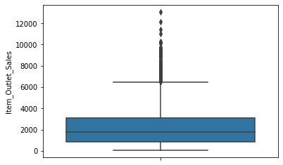
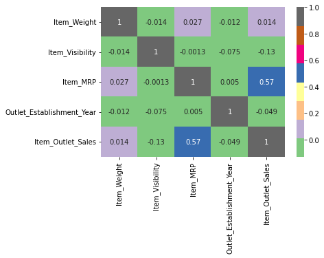

# Sales Prediction Analysis

### Business Problem
   Analyze data to help the retailer understand the properties of products and outlets that play crucial roles in increasing sales.

### The Data
   The Data source is a csv flat file Data named sales prediction which consist of 12 columns and 8524 rows. The dataset consist of 3 datatypes which are objects, floats and an integer. Both Numeric and Categorical data.

### The Method
Import Packages • Load Data • Explore Data • Perform a Validation Split • Preprocess the data • Create the Model • Fit the Model Pipeline on the Training Data and Make Predictions • Evaluate the Model

### Exploratory Visualization

#### Boxplot
   Above is the boxplot visualization of the data target which signifies the monthly range in amount of sales of items in a particular outlet with outliers included, the average amount of sales of items and the highest amount in sales.

#### Feature Correlation

   The purpose of the Heatmap Visualization is to show the correlations (Relationship) between all the features in our dataset.
As we can see, the above Heatmap Shows a positive coefficient correlation between The Item_MRP column and the Item_Outlet_Sales column.

### Summary of Model & Metrics
   In this project, we see 2 different models and its evaluations. The linear regression model and the decision tree. In this project our aim is to predict the Item Outlet Sales which always comes with a continuous numeric values which also makes it a linear regression problem. We used the RMSE to evaluate the accuracy of the model while we used the R2 to evaluate the percentage of variation in the target that our model can explain. And that's I chose to use the linear regression model in order to help predict sales.
